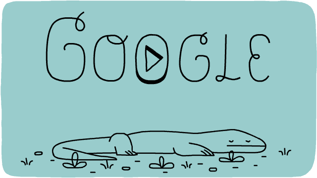

制作卡片
========

## 知识点

* w3-card

### w3-card

制作类似名片的显示效果，w3为我们提供了如下的类：

* w3-card
* w3-card-2
* w3-card-4
* w3-card-8
* w3-card-12
* w3-card-16
* w3-card-24

## 综合例

~~~html

    <h1>卡片秀</h1>
    

        <header class="w3-container w3-blue">
          <h1>我的IT技术</h1>
        </header>
        

          <ul>
            <li>Vue.js</li>
            <li>W3.css</li>
            <li>HTML5</li>
            <li>Typescript</li>
          </ul>
        

        <footer class="w3-container w3-blue">
          <h5>小马视频</h5>
        </footer>
    

    

    

      
      

        
Google是否好用，用过才知道。

      

    

    

    

      
      

      <h4><b>小马</b></h4>
      
Architect and engineer
    
      

    

    

    

      

        <h3>朋友来电</h3>
        
        <h5>小马</h5>
        <button class="w3-button w3-green">接受</button>
        <button class="w3-button w3-red">拒绝</button>
          
      

    

    

    

      <header class="w3-container w3-light-grey">
        <h3>小马</h3>
      </header>
      

        
有1位新的朋友请求

        

        
        
IT工程师，系统架构师，从事数据库系统开发多年，精通前后台开发，目前开始涉足游戏开发，挑战新领域。

      

      <button class="w3-button w3-block w3-dark-grey">+ 连接</button>
    

    

~~~

## 课程文件

* https://git.oschina.net/komavideo/LearnW3CSS

## 小马视频频道

http://i.youku.com/komavideo
https://www.youtube.com/c/小马视频